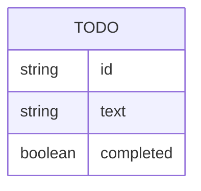

# Domain Model

The whole product turns on a single entity: a to-do item, held only in the browser's in-memory state for the current page view.

`Todo.id` is a client-generated identifier (e.g. a UUID minted in the browser)
used only to key list operations within the current page view — it is never
persisted and never sent anywhere.